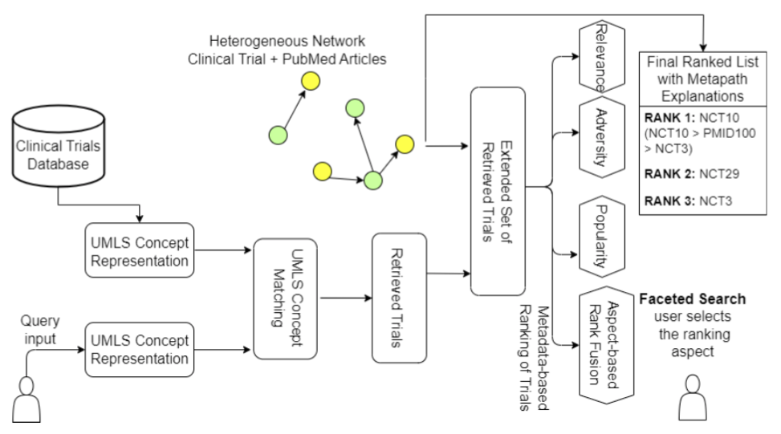

## Interpretable Clinical Trial Retrieval System using Pubmed Citation Network

Authors:  Soumyadeep Roy, Niloy Ganguly, Shamik Sural, Koustav Rudra

Accepted as a full paper at the IEEE International Conference on Digital Health (ICDH 2023) [website link](https://conferences.computer.org/icdh/2023/)

**Abstract**: Clinical trials are an essential source of information for practicing Evidence-Based Medicine because they help to determine the efficacy of newly developed treatments and drugs. However, most of the existing trial search systems focus on a specific disease (e.g., cancer) and utilize disease-specific knowledge bases that hinder the adaptation of such methods to new diseases. In this work, we overcome both limitations and propose a graph-based model that explores both clinical trials and the Pubmed databases to alleviate the shortage of relevant clinical trials for a query. We construct a large heterogeneous graph (750K nodes and 1.2 Million edges) made of clinical trials and Pubmed articles linked to clinical trials. As both the graph edges and nodes are labeled, we develop a novel metapath-based similarity search (MPSS) method to retrieve and rank clinical trials across multiple disease classes. We primarily focus on consumers and users that do not have any prior medical knowledge. As there are no multiple disease-wide trial search evaluation datasets, we contribute a high-quality, well-annotated query-relevant trial set comprising around 25 queries and, on average, approximately 95 annotated trials per query. We also perform a detailed evaluation of MPSS on the TREC Precision Medicine Benchmark Dataset, a disease-specific clinical trial search setting. We make all the codes and data publicly available at https://github.com/roysoumya/MPSS-clinical-trial-search

### Folder Strucutre

#### AdditionalCodes2023
Contains the code and data files for the MPSS model adapted to the TREC 2018 Precision Medicine Track

#### ExtendedRetrieval_MainCodes (new for MPSS)
Contains the code and data files for the retrieval component of metaSTM, metaADV, metaRRF and COMPACT

#### ExtendedRetrieval_Miscellaneous (new for MPSS)
Contains the codes for heterogeneous information network construction, aspect-based rank fusion and other miscellaneous codes.

#### R codes (new for MPSS)
Contains the code to generate the bar plot comparing the retrieval performance of Pubmed in terms of "Only Clinical trials" and "All" filter (Figure 3 of the paper).

#### AllAnnotatedData
1. It contains the 25 annotated queries.
2. 5 queries for each disease class.

#### All_Importan_Data_And_Dump_Data
1. 5 class Csv Files with all fields appended.
2. Pickle File of UMLS concepts for each trial across 5 disease classes.
3. Ranked trials on the basis of 5 relevancy based methodologies.
4. Dump files.

#### BaselineSetup
Contatins the following;-
1. Baseline queries.
2. Indexing and retreiving source files.

#### BigTableAndSmallTable
Calculate Precision, Speraman's Rank oreder correlation and overlap across 25 final queries retrieved trials ranked on the basis of relevancy(5-methods) 

#### clusteringSourceFiles
Contains application of different clustering algorithm like DBScan, Affinity Algorithms on different variations of the data.

#### common_patient_searched_terms
QuickUMLS applied over 1440 lexicons of medDRA common patient terms
Finds the problematic queries.

#### datasetPreparation
From Clinical TRials XMl file to Different classes(26) of disease with all extra fields(Adversity, popularity) appended.

#### RankingOnTheBasisOFRelevancyAlsoAddingColumnsForInclusionExclusionCounts
Rank retrieved trials for 25 quries on the basis of different relevancy(25) methods.

#### TREC2018_goldStandardData
Robustness study
Find:-
1. Precision@10
2. Recall

### Requirements
1. Dump Of the Clinical Trials from the follwing link.
[https://clinicaltrials.gov/AllPublicXML.zip]

2. Setup of QuickUMLS tool.
[https://github.com/Georgetown-IR-Lab/QuickUMLS]

3. Download Adversity Events Reported from the site.
[https://aact.ctti-clinicaltrials.org/pipe_files]

4. Download Elastic Search for the baseline.

4. Enviorment all packages in requirements.txt

